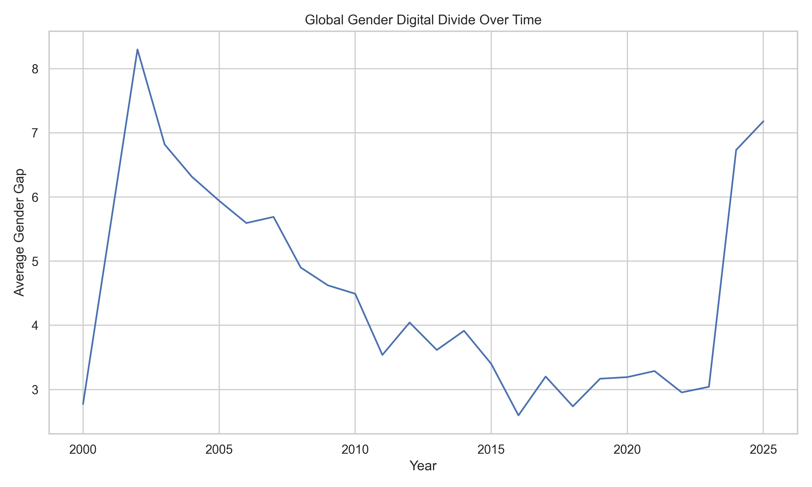
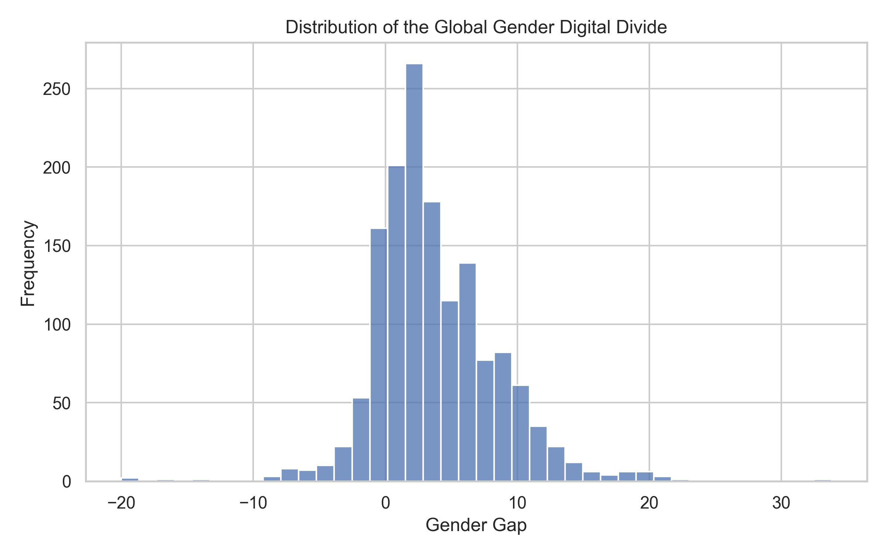
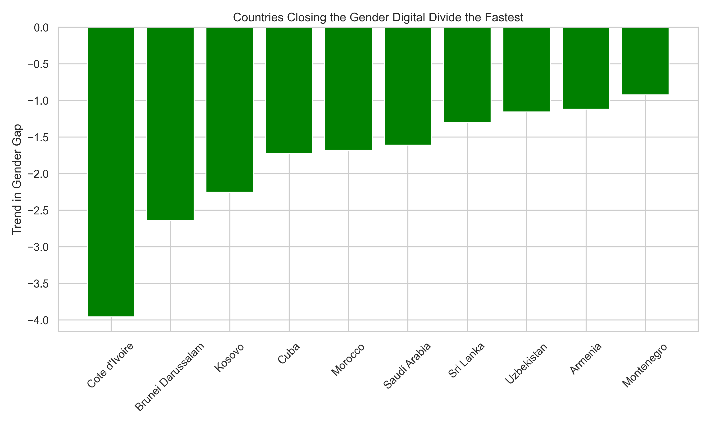
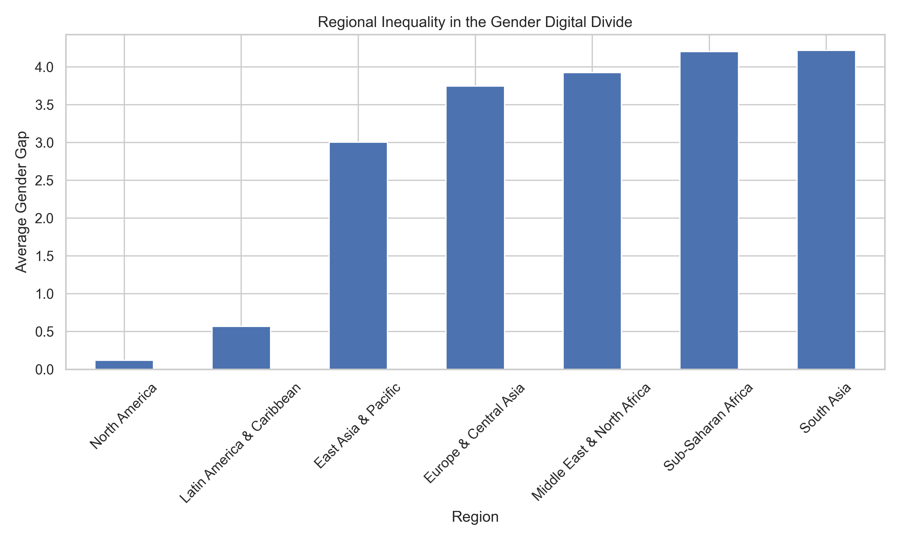
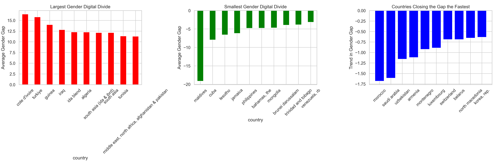
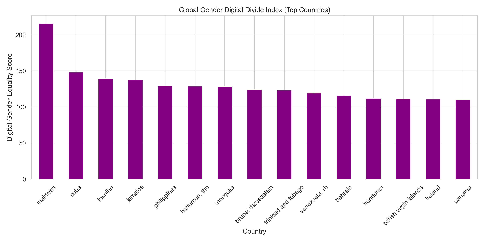

# Bridging the Gender Digital Divide
### A Global Data Analysis of Gender Disparities in Internet Access

## Overview

Access to the internet has become a critical driver of economic opportunity, education, and civic participation in the 21st century. Despite rapid global expansion of digital infrastructure, disparities in digital access persist across demographic groups, particularly along gender lines.

This project investigates the **global gender digital divide**, defined as the difference between male and female internet usage rates across countries and over time.

Using gender-disaggregated indicators from the **World Bank World Development Indicators**, this analysis explores patterns of digital inequality across nearly two decades of global connectivity data.

The study examines how gender disparities in internet access vary across regions, income levels, and time, while identifying countries that have successfully reduced digital gender inequalities.

---

## Research Questions

This study addresses several key questions:

- How large is the gender digital divide across countries?
- Has the gender gap in internet access changed over time?
- Which countries exhibit the largest disparities in digital participation?
- Which countries have made the most progress in closing the gender digital divide?
- How do regional and economic factors influence digital gender equality?

---

## Data Source

World Bank — World Development Indicators

Indicators used:

- Individuals using the Internet, female (% of female population)
- Individuals using the Internet, male (% of male population)

Coverage:

- ~190 countries
- ~20 years of observations

---

## Methodology

The analysis constructs a **Gender Digital Divide metric** defined as:

Gender Gap = Male Internet Usage − Female Internet Usage

Analytical methods include:

- Panel data analysis
- Time-series trend analysis
- Cross-country comparisons
- Linear regression
- Construction of a Gender Digital Divide Index

---

## Key Visualizations

### Global Gender Gap Trend

### Distribution of Gender Disparities

### Countries Closing the Gap

### Regional Inequality

### Global Gender Divide Dashboard

### Gender Digital Divide Index

---

## Key Insights

- Global internet access has expanded significantly, yet gender disparities remain present across many regions.
- Countries with stronger digital infrastructure generally exhibit smaller gender gaps in connectivity.
- Several countries have made notable progress in reducing gender disparities in internet access over time.
- Persistent inequalities suggest that technological diffusion alone is insufficient to eliminate digital gender disparities.

---

## Relevance to Sustainable Development

The gender digital divide intersects with several **United Nations Sustainable Development Goals (SDGs)**:

- **SDG 5: Gender Equality**
- **SDG 9: Industry, Innovation, and Infrastructure**
- **SDG 10: Reduced Inequalities**

Expanding equitable digital access is essential for promoting inclusive economic growth and empowering women in the digital economy.

---

## Tools Used

Python  
Pandas  
Matplotlib  
Seaborn  
Plotly  
SciPy  
Statsmodels

---

## Author

Ronachel Marie  
BSIT — Data Analytics